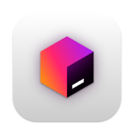

# Dev Toolbox

[](https://github.com/Jcanotorr06/devtoolbox/releases)
[](https://github.com/Jcanotorr06/devtoolbox/blob/main/LICENSE)

Dev Toolbox is a free and open source collection of tools for everyday use to speed up your daily workflow as a developer. Within this app, you can find temporary email, generators (password, lorem ipsum, hash), converters (url parser, yaml/json/csv, number base, cURL), encoders/decoders (Base64, Hex, URL), beautifiers/minifiers (JSON, HTML, CSS, JS), and more.

## Run Locally

First, install dependencies: 

```bash
yarn install
```

Next, run: 

```bash
yarn dev
```

## Tech Stack

This is a T3 Stack project bootstraped with `create-t3-app`.
This project's stack is mainly comprised of:

- [Next.js](https://nextjs.org/)
- [Typescript](https://www.typescriptlang.org/)
- [Tailwind CSS](https://tailwindcss.com/)
- [DaisyUI](https://daisyui.com/)
- [Zustand](https://zustand-demo.pmnd.rs/)
- [Framer Motion](https://www.framer.com/motion/)
- [Tanstack Query](https://tanstack.com/query/v4/)

## Contributors

We 💖 contributors! Feel free to contribute to this project but **please read the [Contributing Guidelines](CONTRIBUTING.md) before opening an issue or PR** so you understand the branching strategy and local development environment.

<a href="https://github.com/jcanotorr06/devtoolbox/graphs/contributors">
  
</a>

Made with [contrib.rocks](https://contrib.rocks).

